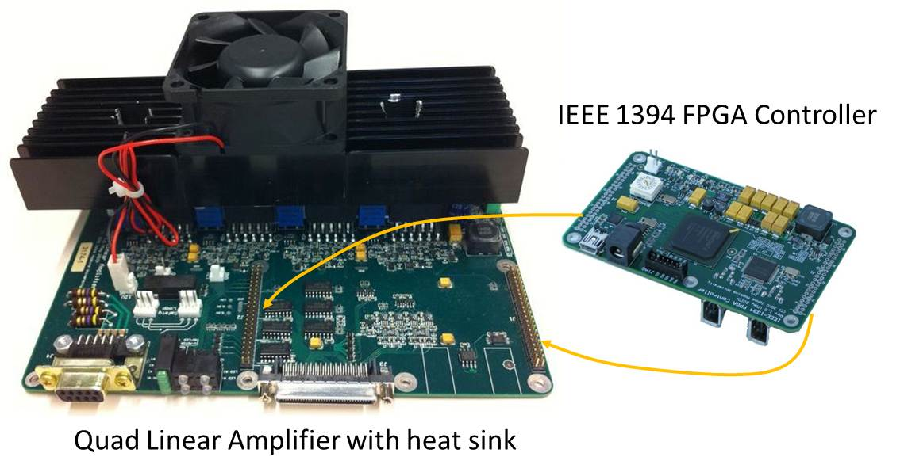

# Open Source Mechatronics

<!-- pic here -->

This site is dedicated to the development of open source mechatronics. Specifically, it contains design files and documentation for a motor controller with an IEEE-1394a (Firewire) interface. The controller consists of two boards: FPGA1394 and QLA. The FPGA1394 board contains a Xilinx FPGA to minimize the latency between the Firewire bus and the controller I/O. The Quad Linear Amplifier (QLA) board contains four linear amplifiers for controlling four DC brush motors. These controllers can be used to drive the da Vinci Research Kit, which consists of the mechanical components of the first-generation da Vinci (known as the da Vinci Classic).

Please clone from git repositories:  
 - Boards Design: [https://github.com/jhu-cisst/mechatronics-boards](https://github.com/jhu-cisst/mechatronics-boards)  
 - Firmware: [https://github.com/jhu-cisst/mechatronics-firmware](https://github.com/jhu-cisst/mechatronics-firmware)  
 - Software: [https://github.com/jhu-cisst/mechatronics-software](https://github.com/jhu-cisst/mechatronics-software)  

See also  [Robotics Infrastructure - Mechatronics](https://www.lcsr.jhu.edu/Infrastructure/Mechatronic).

## Documentation

### Software
 * [Development Environment (Linux)](https://github.com/jhu-cisst/mechatronics-software/wiki/Development-Environment)
 * [Interface Specification (IEEE-1394 packet formats)](https://github.com/jhu-cisst/mechatronics-software/wiki/InterfaceSpec)
 * [Low-level Software API](https://github.com/jhu-cisst/mechatronics-software/wiki/Low-Level-Software-API)
 * [Low-level Example Programs](https://github.com/jhu-cisst/mechatronics-software/wiki/Example-Programs)
 * [da Vinci Research Kit](https://github.com/jhu-dvrk/sawIntuitiveResearchKit/wiki)

### Hardware
 * FPGA-1394 Board:
   * [Release Notes](https://github.com/jhu-cisst/FPGA1394#release-notes)
   * Schematics: [Rev 1.2](https://github.com/jhu-cisst/FPGA1394/blob/Rev1.2/FPGA1394-Schematics.pdf), [Rev 1.0/1.1](https://github.com/jhu-cisst/FPGA1394/blob/Rev1.1/FPGA1394-Schematics.pdf)
 * Quad Linear Amplifier (QLA) Board:
   * [Release Notes](https://github.com/jhu-cisst/QLA#release-notes)
   * Schematics: [Rev 1.3](https://github.com/jhu-cisst/QLA/blob/Rev1.3-2014/QLA-Schematics.pdf), [Rev 1.2](https://github.com/jhu-cisst/QLA/blob/Rev1.2/QLA-Schematics.pdf)
 * [How to program the FPGA board](https://github.com/jhu-cisst/mechatronics-firmware/wiki/FPGA-Program)
 * [FPGA firmware release notes](https://github.com/jhu-cisst/mechatronics-firmware/wiki/FPGA-Release-Note)

